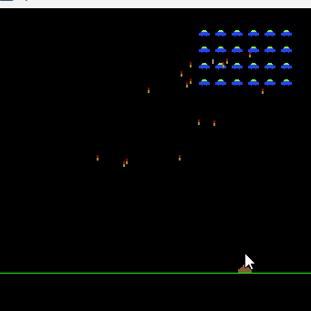

# Sourcing Aliens and Lasers: Event-Sourced Space Invaders

This is an adaptation of the Java Space Invaders game clone made by Jan Bodnar.

This adaptation demonstrates how to use Event Sourcing in a simple and fun way.
It also shows how to use a DCB Event Store and how to replay events for time travel.

Space Invaders is an arcade video game designed by Tomohiro Nishikado. It was first released in 1978.

In the Space Invaders game, the player controls a laser. He is about to save the Earth from invasion of evil space invaders.

In this Java clone we have 24 invaders. These aliens heavily shell the ground. When the player shoots a laser beam,
he can shoot another one only when it hits an alien or the top of the Board. The player shoots with the Space key.
Aliens launch randomly their bombs. Each alien shoots a bomb only after the previous one hits the bottom.

## Running the game

Before running the game, first run a Maven build of the [in-memory event store](https://github.com/AukeHaanstra/eventstore),
then run a Maven build of space-invaders. Run the game by starting the SpaceInvaders class.

## Controls

To play, use the left and right **arrow keys** to move, and use **space** to shoot a laser beam.

To enter time travel mode, press **\<enter\>**, then use square brackets, **\[** and **\]**, to travel backward and forward through time.
Press **\<enter\>** again to continue the game where you left off.

## Credits

A description of the original game can be found at:
https://zetcode.com/javagames/spaceinvaders/

